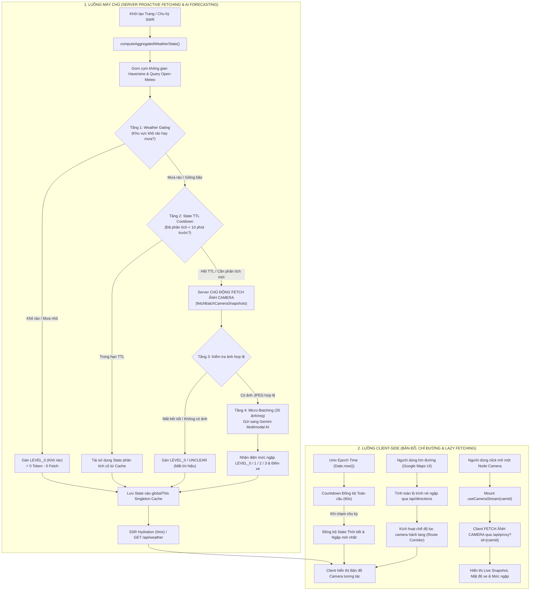
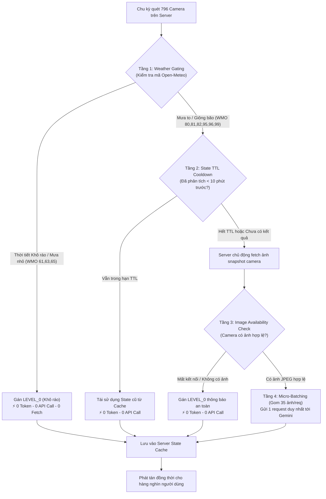

# 🚦 VENHA - HỆ THỐNG GIÁM SÁT CAMERA GIAO THÔNG & CHẨN ĐOÁN NGẬP LỤT TP. HỒ CHÍ MINH

Hệ thống bản đồ số trực quan hóa hơn **790+ Camera giao thông** thực tế tại TP. Hồ Chí Minh, tích hợp dự báo thời tiết cục bộ, công cụ tìm kiếm lộ trình né ngập thông minh phong cách **Google Maps**, phân tích mật độ xe & chẩn đoán ngập úng đô thị bằng **Google Gemini Multimodal AI**.

---

## 🌟 TÍNH NĂNG NỔI BẬT

- 🗺️ **Bản đồ Camera Full màn hình**: Tích hợp dữ liệu hơn 796 camera giao thông với tọa độ GPS chính xác tại TP.HCM, hỗ trợ chuyển đổi lớp bản đồ Đường phố / Vệ tinh Google Maps và chế độ Sáng / Tối (Dark/Light mode).
- 🛣️ **Tìm kiếm & Chỉ đường né ngập (Google Maps Style Directions)**:
  - Thanh tìm kiếm và bảng điều khiển chỉ đường 3 cột chuẩn phong cách Google Maps (`○ Điểm xuất phát` $\rightarrow$ `⋮` $\rightarrow$ `📍 Điểm đến` + Nút đảo chiều `⇅`).
  - Tìm kiếm địa điểm, địa chỉ chính xác tại TP.HCM kết hợp định vị GPS vị trí hiện tại.
  - Tự động quét và phát hiện các điểm ngập nước trên lộ trình, đề xuất các tuyến đường vòng tránh ngập an toàn kèm thời gian di chuyển, khoảng cách (km) và liên kết mở nhanh trên Google Maps.
- 🎯 **Lọc Camera thông minh theo Lộ trình (Route Corridor Filtering)**: Khi người dùng tìm đường, bản đồ tự động chuyển sang chế độ tập trung — **chỉ hiển thị các camera nằm dọc theo hành lang tuyến đường đi** (bán kính ~800m), ẩn bớt các camera ngoài luồng giúp giao diện thông thoáng, dễ quan sát.
- 🚦 **Theo dõi Mật độ Giao thông & Kẹt xe (Traffic Density Engine)**:
  - Tích hợp cơ sở dữ liệu hơn 60+ điểm nóng giao thông trọng điểm TP.HCM (Hàng Xanh, Lăng Cha Cả, An Sương, Cầu Bình Triệu, Cầu Kênh Tẻ, Vòng xoay Dân Chủ, Ngã sáu Gò Vấp...).
  - Mô phỏng theo mô hình giờ cao điểm kết hợp Gemini Vision AI đếm xe trong khung hình để phân loại 4 mức độ: Thông thoáng (🟢), Đông đúc (🟡), Di chuyển chậm (🟠), Ùn ứ / Kẹt xe (🔴).
- 🌊 **Danh mục 25+ Điểm Hay Ngập do Triều Cường & Mưa Lớn**: Nút truy cập nhanh danh sách các điểm rốn ngập kinh niên tại TP.HCM (Trần Xuân Soạn, Huỳnh Tấn Phát, Quốc lộ 13, Nguyễn Văn Hưởng, Ung Văn Khiêm, Thảo Điền, v.v.) kèm camera giám sát trực tiếp.
- 🐱 **Trợ lý Mascot Mèo Mặc Áo Mưa & Favicon Nhận Diện**: Linh vật Mèo vui nhộn xuất hiện đưa ra lời khuyên thời tiết & gợi ý lộ trình an toàn theo thời gian thực.
- ⚡ **0ms Cold-Start SSR Hydration**: Trạng thái thời tiết và cảnh báo ngập của toàn bộ 796 camera được nạp sẵn từ máy chủ, người dùng mở trang có dữ liệu ngay lập tức.
- ⏱️ **Đồng bộ Countdown Toàn cầu (Global Epoch Time)**: Đồng hồ đếm lùi chu kỳ thời tiết & ngập lụt được tính toán theo mốc Unix Epoch tuyệt đối, đảm bảo mọi client trên thế giới luôn đếm đúng cùng một nhịp giây.
- 🛡️ **4 Tầng Phòng Vệ Tiết Kiệm Token AI**: Weather Gating, State TTL Cooldown (10 phút), Server Snapshot Stream Check và Micro-batching (35 ảnh/request) giúp triệt tiêu hoàn toàn việc lạm dụng API Gemini.
- 🌦️ **Dự báo thời tiết cục bộ Open-Meteo & Gom cụm Haversine**: Gom 796 camera theo bán kính không gian để lấy mẫu đại diện, giảm hơn 95% request mạng.

---

## 🏛️ KIẾN TRÚC TỔNG QUAN HỆ THỐNG (SYSTEM ARCHITECTURE)

Hệ thống hoạt động theo mô hình phân tách 2 luồng độc lập giữa **Server-side (Chủ động dự báo thời tiết & ngập lụt qua AI)** và **Client-side (Bản đồ tương tác, Chỉ đường & Lazy Fetching camera)**:



---

## 🛣️ 1. HỆ THỐNG CHỈ ĐƯỜNG NÉ NGẬP (GOOGLE MAPS STYLE)

Giao diện chỉ đường được thiết kế theo phong cách tối giản, hiện đại của Google Maps:

```
┌────────────────────────────────────────────────────────────┐
│  [  ○  ]  [ Vị trí của bạn (Điểm đi)             ] [📍GPS] │
│     ⋮                                                  │  [ ⇅ ]
│  [  📍 ]  [ Nhập điểm đến...                     ] [ ✕ ]   │
└────────────────────────────────────────────────────────────┘
```

- **Lựa chọn lộ trình an toàn**: Hệ thống tính toán nhiều phương án đường đi, gắn nhãn trực quan `🟢 Khô ráo` hoặc `⚠️ Có ngập`, đồng thời đánh dấu tuyến đường `Khuyên dùng` tối ưu nhất.
- **Hành lang lọc Camera (Corridor Filtering)**: Khi lộ trình được vẽ lên bản đồ, hệ thống tự động tính khoảng cách từ 796 camera đến đường đi (bằng giải thuật hình chiếu Haversine $d_{\bot} \le 800\text{ m}$). Chỉ những camera phục vụ việc theo dõi tuyến đường mới được hiển thị, loại bỏ hoàn toàn tình trạng rối mắt bởi quá nhiều icon.

---

## 🚦 2. ĐỘNG CƠ ĐÁNH GIÁ MẬT ĐỘ GIAO THÔNG (TRAFFIC DENSITY)

Mật độ giao thông được tổng hợp từ 3 nguồn:
1. **Mô hình Giờ Cao Điểm & 60+ Điểm Nóng**: Tự động tăng mức cảnh báo giao thông tại các trục đường chính và nút giao huyết mạch vào khung giờ cao điểm (Sáng: 07:00 - 09:00, Chiều: 17:00 - 19:30).
2. **Thị giác Máy tính Google Gemini AI**: Đếm số lượng phương tiện thực tế từ khung hình camera (xe máy, ô tô, xe buýt).
3. **Mối liên hệ Thời tiết & Ngập nước**: Tuyến đường ngập sâu sẽ tự động đẩy mật độ xe lên mức `Ùn ứ / Kẹt xe`.

| Mức mật độ | Ký hiệu | Màu sắc | Mô tả tình trạng |
| :--- | :---: | :---: | :--- |
| **Thông thoáng** | `LOW` | 🟢 Xanh lục | Đường vắng, xe cộ lưu thông với tốc độ tối đa |
| **Đông đúc** | `MODERATE` | 🟡 Vàng cam | Lưu lượng xe đông, di chuyển ổn định |
| **Di chuyển chậm** | `HIGH` | 🟠 Cam đỏ | Mật độ xe dày đặc, tốc độ di chuyển chậm |
| **Ùn ứ / Kẹt xe** | `JAM` | 🔴 Đỏ đậm | Xe cộ dừng đỗ kéo dài, di chuyển từng nhích |

---

## 🧠 3. MÔ HÌNH 4 TẦNG PHÒNG VỆ CHỐNG LẠM DỤNG GEMINI AI

Để kiểm soát chặt chẽ chi phí token và tránh lạm dụng API Google Gemini, hệ thống triển khai kiến trúc **4 tầng phòng vệ (Defense-in-Depth)** kết hợp chủ động nạp ảnh trên máy chủ:



1. **Tầng 1 - Weather Gating:** Tuyệt đối không gọi Gemini cho các camera ở vùng không mưa hoặc mưa nhỏ (`61, 63, 65`). Tự động gán `LEVEL_0` với **0 token và 0 ảnh cần nạp**.
2. **Tầng 2 - State TTL Cooldown (`GEMINI_FLOOD_TTL_MINUTES=10`):** Mức ngập lụt không thay đổi theo từng giây. Kết quả phân tích được giữ nguyên trong **10 phút**. Trong suốt thời gian này, các chu kỳ quét 60s tiếp theo kế thừa lại kết quả cũ mà **không gọi lại Gemini**.
3. **Tầng 3 - Server Proactive Image Check:** Máy chủ chủ động nạp ảnh từ cổng giao thông cho các camera trong vùng mưa bão. Chỉ gửi ảnh sang Gemini khi camera đang hoạt động và có luồng ảnh thực tế. Bỏ qua các camera mất tín hiệu.
4. **Tầng 4 - Micro-Batching ($35\text{ ảnh/request}$):** Đóng gói tối đa 35 camera vào một mảng Multimodal Array duy nhất theo định dạng JSON Structured Output, giảm hơn 80% chi phí token so với gọi đơn lẻ.
5. **Tập trung hóa Server (Centralized Pipeline):** Người dùng không được gọi trực tiếp Gemini từ trình duyệt. Dù có **1.000 người dùng cùng online**, máy chủ cũng chỉ phân tích **1 lần duy nhất** và chia sẻ state cho tất cả.

---

## 🎨 4. QUY TẮC MÀU SẮC & TRẠNG THÁI NODE CAMERA

Node camera dạng tròn $24\times24\text{ px}$ thể hiện trực quan cấp độ ngập và ký hiệu thời tiết:

| Trạng thái màu | Cấp độ ngập | Điều kiện kích hoạt | Ý nghĩa thực tế |
| :--- | :---: | :---: | :--- |
| 🟢 **Màu xanh lá** (`#059669`) | **Level 0 (Mặc định)** | Thời tiết khô ráo, mưa nhỏ (61/63/65) hoặc tuyến đường không ngập | Tuyến đường thông suốt, an toàn |
| 🟡 **Màu vàng cam** (`#f59e0b`) | **Level 1** | Sau khi phân tích AI xác nhận | Ngập nhẹ mép vỉa hè ($< 15\text{ cm}$) |
| 🟠 **Màu cam đỏ** (`#ea580c`) | **Level 2** | Sau khi phân tích AI xác nhận | Ngập vừa nửa bánh xe ($15 - 40\text{ cm}$) |
| 🔴 **Màu đỏ nhấp nháy** (`#e11d48`) | **Level 3** | Sau khi phân tích AI xác nhận | **Báo động ngập sâu ($> 40\text{ cm}$), nguy cơ chết máy** |

### Ký hiệu thời tiết bên trong Node (Mã WMO):
* 🍃 **Lá cây (Khô ráo)**: Thời tiết quang mây, nắng ráo, không mưa.
* 💧 **Giọt nước (Mưa)**: Mưa nhỏ, mưa vừa rải rác (WMO `61, 63, 65`).
* 🌧️ **Đám mây mưa (Mưa rào)**: Mưa rào diện rộng, mưa nặng hạt (WMO `80, 81, 82`).
* ⚡ **Lốc xoáy / Sấm sét (Giông bão)**: Giông sét kèm gió giật và mưa đá (WMO `95, 96, 99`).

---

## ⚙️ 5. CẤU HÌNH BIẾN MÔI TRƯỜNG (.env)

Tạo file `.env` hoặc `.env.local` tại thư mục gốc dự án:

```env
# ==========================================
# 1. Cấu hình Gemini AI (Phân tích ngập lụt & Mật độ xe)
# ==========================================
GEMINI_API_KEY=your_gemini_api_key_here
GEMINI_MODEL=gemma-4-26b-a4b-it
GEMINI_FALLBACK_MODEL=gemini-3.5-flash
GEMINI_MEDIA_RESOLUTION=MEDIA_RESOLUTION_LOW
GEMINI_BATCH_SIZE=35

# Thời gian lưu giữ kết quả phân tích AI trước khi quét lại (tính theo phút, mặc định 10 phút)
GEMINI_FLOOD_TTL_MINUTES=10

# Prompt phân tích ngập lụt & giao thông
GEMINI_FLOOD_PROMPT="Analyze street camera images for flood severity and traffic density. Return concise JSON array matching schema."

# ==========================================
# 2. Cấu hình chu kỳ làm mới & đồng bộ
# ==========================================
# Chu kỳ tự động làm mới ảnh camera đang mở (tính theo giây)
NEXT_PUBLIC_CAMERA_REFRESH_INTERVAL=30

# Chu kỳ tự động kiểm tra thời tiết Open-Meteo & đồng bộ ngập lụt (tính theo giây)
NEXT_PUBLIC_FLOOD_INTERVAL=60

# Bán kính gom cụm trạm thời tiết Haversine (tùy chỉnh bán kính phù hợp)
# NEXT_PUBLIC_WEATHER_SAMPLE_RADIUS_KM=2.5

# ==========================================
# 3. Tùy chọn Session Cookie Cổng giao thông
# ==========================================
# CAMERA_COOKIE=".VDMS=...; CurrentLanguage=vi;"
```

---

## 🚀 6. HƯỚNG DẪN CÀI ĐẶT & TRIỂN KHAI

### 1. Cài đặt thư viện dependencies:
```bash
npm install
```

### 2. Chạy môi trường phát triển (Development):
```bash
npm run dev
```
Mở trình duyệt tại: [http://localhost:3000](http://localhost:3000)

### 3. Kiểm tra Build & Chạy Production:
```bash
npm run build
npm run start
```
