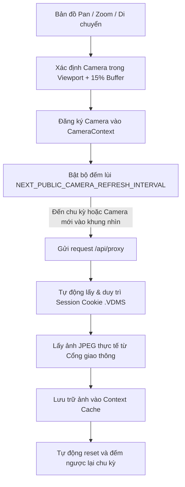
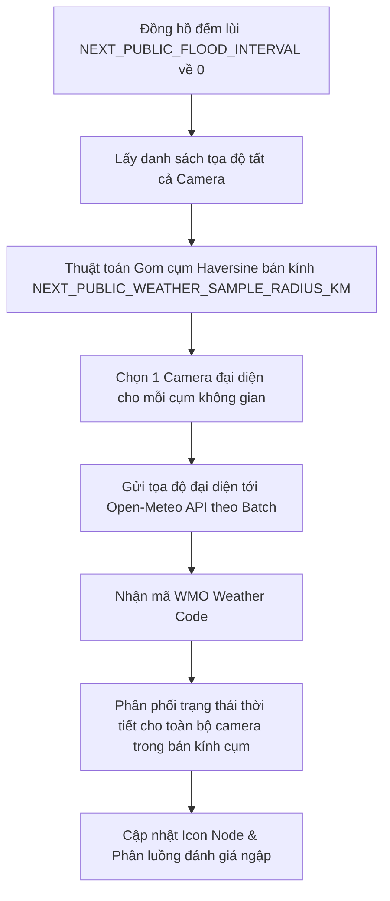
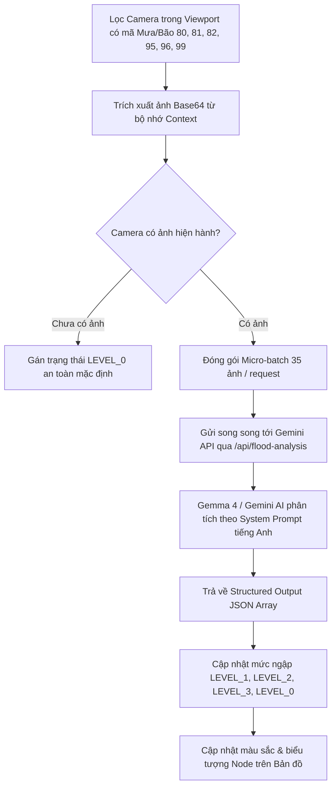

# 🚦 VENHA - HỆ THỐNG GIÁM SÁT CAMERA GIAO THÔNG & CHẨN ĐOÁN NGẬP LỤT AI (TP. HỒ CHÍ MINH)

Hệ thống bản đồ trực quan hóa hơn **790+ Camera giao thông** thực tế tại TP. Hồ Chí Minh trên nền tảng bản đồ số tương tác cao, tích hợp dự báo thời tiết cục bộ và phân tích mức độ ngập lụt tự động bằng **Google Gemini Multimodal AI**.

---

## 🌟 TÍNH NĂNG NỔI BẬT

- 🗺️ **Bản đồ Camera Full màn hình**: Tích hợp dữ liệu 796 camera với tọa độ GPS chính xác, hỗ trợ chuyển đổi lớp bản đồ Đường phố / Vệ tinh Google Maps.
- ⚡ **Viewport Culling (Tối ưu 60 FPS)**: Chỉ render và nạp luồng camera thực sự nằm trong tầm nhìn bản đồ.
- 🎯 **Visual State Key Caching**: Triệt tiêu hoàn toàn hiện tượng rung giật node (marker jitter) khi di chuyển bản đồ hoặc nạp ảnh.
- ⏱️ **Đồng bộ hóa 2 chu kỳ đếm ngược độc lập**:
  - Chu kỳ làm mới ảnh camera theo khung nhìn (`NEXT_PUBLIC_CAMERA_REFRESH_INTERVAL`).
  - Chu kỳ quét thời tiết và phân tích ngập lụt AI (`NEXT_PUBLIC_FLOOD_INTERVAL`).
- 🌦️ **Dự báo thời tiết cục bộ Open-Meteo & Gom cụm Haversine**: Tự động xác định trạng thái mưa/giông bão theo từng khu vực bán kính $x\text{ km}$, giảm hơn 95% request mạng.
- 🧠 **Chẩn đoán ngập lụt thông minh với Gemini AI**: Tự động phân tích ảnh chụp từ camera để xác định mức độ ngập úng đô thị theo thời gian thực với định dạng Structured Output JSON.

---

## 📸 1. NGUYÊN LÝ FETCH HÌNH ẢNH CAMERA & VIEWPORT CULLING



### Chi tiết kỹ thuật:
1. **Viewport Culling & Buffer Padding**:
   - Khi bản đồ di chuyển hoặc thay đổi độ phóng to, hàm `updateVisibleMarkers` tính toán biên quan sát với vùng đệm 15% (`map.getBounds().pad(0.15)`).
   - Chỉ các camera nằm trong viewport mới được đưa vào danh sách kích hoạt (`updateActiveViewportCameras`).
   - Khi camera trượt ra ngoài vùng quan sát, marker sẽ được thu hồi khỏi bộ nhớ để tối ưu tài nguyên DOM và CPU/RAM.
2. **Triệt tiêu hiện tượng giật Marker (Anti-Jitter Mechanism)**:
   - Lưu trữ `_visualKey` và `_tooltipContent` trực tiếp trên đối tượng Marker của Leaflet.
   - Bản đồ **chỉ** gọi `existingMarker.setIcon(...)` khi trạng thái màu sắc hoặc icon thời tiết thực sự có sự thay đổi. Tránh việc xóa/tạo lại DOM node liên tục.
3. **Quản lý Session Cookie tự động (`/api/proxy`)**:
   - Máy chủ giao thông TP.HCM yêu cầu cookie phiên `.VDMS` hợp lệ.
   - Endpoint proxy tích hợp cơ chế tự động lấy cookie phiên mới và lưu trong bộ nhớ (cache 10 phút), tự động thử lại (retry) khi gặp mã phản hồi 403.

---

## 🌦️ 2. NGUYÊN LÝ FETCH THỜI TIẾT & GOM CỤM KHÔNG GIAN



### Thuật toán Gom cụm bán kính không gian trong Viewport:
- Sử dụng công thức khoảng cách mặt cầu **Haversine**:
  $$d = 2R \arcsin\left(\sqrt{\sin^2\left(\frac{\Delta\text{lat}}{2}\right) + \cos(\text{lat}_1)\cos(\text{lat}_2)\sin^2\left(\frac{\Delta\text{lng}}{2}\right)}\right)$$
- Các camera nằm trong **Viewport** được gom thành các cụm đại diện tương ứng bán kính `NEXT_PUBLIC_WEATHER_SAMPLE_RADIUS_KM` (mặc định 2.5–5km).
- Hệ thống chỉ gửi tọa độ của các camera đại diện đến Open-Meteo, sau đó đồng bộ (broadcast) kết quả thời tiết cho các camera lân cận trong bán kính, giúp giảm 95% request mạng.

### Bảng phân loại mã WMO, Icon & Luồng chẩn đoán:
| Mã WMO | Loại thời tiết | Icon Node | Luồng chẩn đoán ngập lụt |
| :--- | :--- | :---: | :--- |
| **`61, 63, 65`** | Mưa nhỏ, mưa vừa, mưa to | `<Droplet />` | **Tự động gán `LEVEL_0` (🟢 Xanh lá - Tuyến đường thông thoáng)**, không gọi AI |
| **`80, 81, 82`** | Mưa rào, mưa xối xả | `<CloudRain />` | **Nếu có ảnh trong khung nhìn: Kích hoạt Gemini AI** phân tích độ sâu ngập |
| **`95, 96, 99`** | Giông bão, sấm sét, mưa đá | `<Tornado />` | **Nếu có ảnh trong khung nhìn: Kích hoạt Gemini AI** phân tích độ sâu ngập |
| **Các mã khác** | Nắng, mây rải rác, gió nhẹ | `<Leaf />` | **Tự động gán `LEVEL_0` (🟢 Xanh lá - Khô ráo)** sau chu kỳ kiểm tra |

---

## 🧠 3. NGUYÊN LÝ PHÂN TÍCH NGẬP LỤT BẰNG GEMINI VISION AI



### Tiêu chuẩn phân cấp độ ngập:
- 🟢 **LEVEL_0 (Không ngập / Bình thường)**: Mặt đường khô ráo hoặc chỉ có vệt nước nhỏ. Tự động áp dụng cho thời tiết bình thường, mã mưa nhẹ/vừa (61, 63, 65) và tất cả các camera còn lại.
- 🟡 **LEVEL_1 (Ngập nhẹ)**: Mực nước xấp xỉ mép vỉa hè / mắt cá chân ($< 15\text{ cm}$).
- 🟠 **LEVEL_2 (Ngập vừa)**: Nước ngập nửa bánh xe máy / ngang đầu gối ($15\text{ cm} - 40\text{ cm}$).
- 🔴 **LEVEL_3 (Ngập nặng)**: Nước ngập lút bánh xe máy, ngập nắp capo ô tô ($> 40\text{ cm}$).

### Tối ưu hóa hiệu năng AI:
- **Tận dụng Context Cache**: Trích xuất trực tiếp base64 từ luồng ảnh hiện có trên giao diện qua HTML5 Canvas, không tải lại ảnh từ máy chủ.
- **Micro-batching**: Đóng gói 35 ảnh/request và thực thi bất đồng bộ song song (`Promise.all`).
- **Cấu hình độ phân giải**: `media_resolution = "MEDIA_RESOLUTION_LOW"` giảm thiểu chi phí token và rút ngắn thời gian xử lý.
- **Structured Output**: Sử dụng JSON Schema bắt buộc Gemini/Gemma trả về đúng định dạng mảng dữ liệu.
- **Model Fallback Chain**: Tự động chuyển đổi giữa model chính (`gemma-4-26b-a4b-it`) và model fallback (`gemini-3.5-flash`, `gemma-4-31b-it`, `gemini-3.1-flash-lite`).

---

## 🎨 4. QUY TẮC MÀU SẮC & TRẠNG THÁI NODE CAMERA

Node camera được thiết kế tinh gọn dạng hình tròn $24\times24\text{ px}$ không viền, biểu thị màu sắc trực quan (hoàn toàn không sử dụng màu trắng, không phân biệt có ảnh hay không để gán màu):

| Trạng thái màu | Cấp độ | Điều kiện hiển thị | Ý nghĩa thực tế |
| :--- | :---: | :--- | :--- |
| 🟢 **Màu xanh lá** (`#16a34a`) | **Level 0 (Mặc định)** | Mặc định ban đầu & tất cả camera an toàn (thời tiết thường, mưa 61/63/65, không ngập) | Tuyến đường thông thoáng, an toàn |
| 🟡 **Màu cam** (`#f59e0b`) | **Level 1** | Sau khi Gemini/Gemma AI phân tích | Cảnh báo ngập nhẹ ($< 15\text{ cm}$) |
| 🟠 **Màu cam đỏ** (`#ea580c`) | **Level 2** | Sau khi Gemini/Gemma AI phân tích | Cảnh báo ngập vừa ($15 - 40\text{ cm}$) |
| 🔴 **Màu đỏ nhấp nháy** (`#e11d48`) | **Level 3** | Sau khi Gemini/Gemma AI phân tích | **Báo động ngập nặng ($> 40\text{ cm}$)** |

---

## ⚙️ 5. CẤU HÌNH BIẾN MÔI TRƯỜNG (.env)

Tạo file `.env` tại thư mục gốc của dự án với các tham số cấu hình:

```env
# Gemini / Gemma AI Configuration
GEMINI_API_KEY=your_gemini_api_key_here
GEMINI_MODEL=gemma-4-26b-a4b-it
GEMINI_FALLBACK_MODEL=gemini-3.5-flash
GEMINI_MEDIA_RESOLUTION=MEDIA_RESOLUTION_LOW
GEMINI_BATCH_SIZE=35
GEMINI_FLOOD_PROMPT="Analyze street camera images for flood severity based on real-world reference levels: LEVEL_0: Dry road or minor wet patches. LEVEL_1: Ankle-deep / curb-level water (<15cm). LEVEL_2: Half motorcycle wheel / knee-deep water (15cm-40cm). LEVEL_3: Submerged motorcycle wheel / car hood-level water (>40cm). UNCLEAR: Blurry, dark, corrupted, or obstructed view. Return concise JSON array matching schema."

# Chu kỳ tự động làm mới ảnh camera trong khung nhìn (Tính bằng giây)
NEXT_PUBLIC_CAMERA_REFRESH_INTERVAL=30

# Chu kỳ tự động quét thời tiết và phân tích ngập lụt AI (Tính bằng giây)
NEXT_PUBLIC_FLOOD_INTERVAL=60

# Bán kính gom cụm trạm thời tiết trong khung nhìn (Tính bằng Kilomet)
NEXT_PUBLIC_WEATHER_SAMPLE_RADIUS_KM=2.5
```

---

## 🚀 6. HƯỚNG DẪN CÀI ĐẶT & CHẠY DỰ ÁN

1. **Cài đặt thư viện dependencies:**
   ```bash
   npm install
   ```

2. **Chạy máy chủ phát triển (Development Mode):**
   ```bash
   npm run dev
   ```
   Truy cập trình duyệt tại: [http://localhost:3000](http://localhost:3000)

3. **Kiểm tra và Build Production:**
   ```bash
   npm run build
   npm run start
   ```
