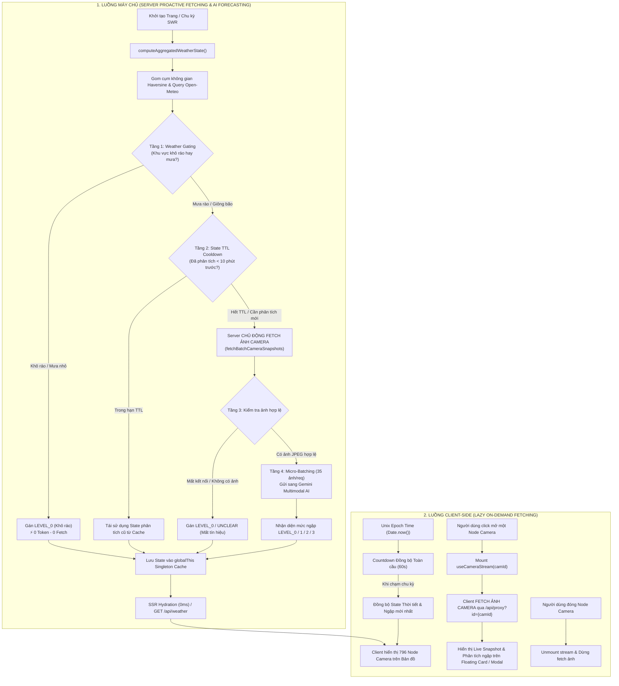
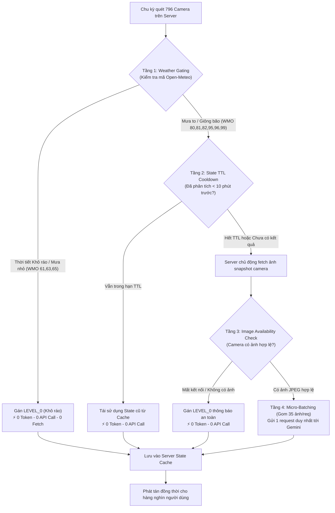

# 🚦 VENHA - HỆ THỐNG GIÁM SÁT CAMERA GIAO THÔNG & CHẨN ĐOÁN NGẬP LỤT TP. HỒ CHÍ MINH

Hệ thống bản đồ trực quan hóa hơn **790+ Camera giao thông** thực tế tại TP. Hồ Chí Minh trên nền tảng bản đồ số tương tác cao, tích hợp dự báo thời tiết cục bộ thời gian thực và phân tích mức độ ngập úng đô thị thông minh bằng **Google Gemini Multimodal AI**.

---

## 🌟 TÍNH NĂNG NỔI BẬT

- 🗺️ **Bản đồ Camera Full màn hình**: Tích hợp dữ liệu 796 camera giao thông với tọa độ GPS chính xác, hỗ trợ chuyển đổi lớp bản đồ Đường phố / Vệ tinh Google Maps.
- ⚡ **0ms Cold-Start SSR Hydration**: Trạng thái thời tiết và cảnh báo ngập của toàn bộ 796 camera được nạp sẵn ngay từ máy chủ (Server Component), người dùng mở trang có dữ liệu ngay lập tức mà không cần fetch lại từ đầu.
- ⏱️ **Đồng bộ Countdown Toàn cầu (Global Epoch Time)**: Đồng hồ đếm lùi chu kỳ thời tiết & ngập lụt được tính toán theo mốc Unix Epoch tuyệt đối, đảm bảo mọi client trên thế giới luôn đếm đúng cùng một nhịp giây.
- 🎯 **Lazy Fetching On-Demand (Tối ưu Client)**: Các node camera trên bản đồ hiển thị dạng marker gọn nhẹ; client **chỉ fetch ảnh khi người dùng thực sự mở xem một node camera** (bật thẻ xem nhanh ở góc màn hình hoặc mở modal phóng to), tiết kiệm tối đa băng thông và tài nguyên trình duyệt.
- 🤖 **Server Proactive Fetching (Chủ động dự báo lũ)**: Máy chủ chủ động nạp ảnh camera tại các khu vực đang có mưa/bão để cung cấp cho Google Gemini AI phân tích mực nước và phân loại mức ngập lụt tự động.
- 🛡️ **4 Tầng Phòng Vệ Tiết Kiệm Token AI**: Cơ chế Weather Gating, State TTL Cooldown (10 phút), Server Snapshot Stream Check và Micro-batching (35 ảnh/request) giúp triệt tiêu hoàn toàn việc lạm dụng API Gemini.
- 🌦️ **Dự báo thời tiết cục bộ Open-Meteo & Gom cụm Haversine**: Gom 796 camera theo bán kính không gian để lấy mẫu đại diện, giảm hơn 95% request mạng.
- 🚀 **Tối ưu hóa Vercel Serverless**: Kiến trúc In-Memory SWR Cache kết hợp Serverless Edge Handlers giúp chia sẻ 1 kết quả tính toán cho hàng nghìn người dùng truy cập đồng thời.

---

## 🏛️ KIẾN TRÚC TỔNG QUAN HỆ THỐNG (SYSTEM ARCHITECTURE)

Hệ thống hoạt động theo mô hình phân tách 2 luồng độc lập giữa **Server-side (Chủ động dự báo thời tiết & ngập lụt qua AI)** và **Client-side (Lazy Fetching hình ảnh khi mở node camera)**:



---

## 🔄 1. CƠ CHẾ ĐỒNG BỘ THỜI TIẾT & COUNTDOWN TOÀN CẦU

### A. Công thức đồng bộ Countdown theo Unix Epoch
Thay vì dùng `setInterval` đếm lùi độc lập trong từng trình duyệt (gây lệch giây khi người dùng F5 hoặc mở tab ở các thời điểm khác nhau), hệ thống tính toán đồng hồ đếm ngược trực tiếp từ thời gian Epoch toàn cầu:

$$\text{elapsed} = \lfloor \text{Date.now()} / 1000 \rfloor \pmod{\text{NEXT\_PUBLIC\_FLOOD\_INTERVAL}}$$
$$\text{countdown} = \text{NEXT\_PUBLIC\_FLOOD\_INTERVAL} - \text{elapsed}$$

* **Đặc tính:** Tất cả client tại mọi vị trí địa lý đều đếm lùi chính xác cùng 1 nhịp giây với máy chủ.
* Khi `countdown === NEXT_PUBLIC_FLOOD_INTERVAL` (bắt đầu chu kỳ mới), client tự động gọi `GET /api/weather` để nhận bản cập nhật mới nhất.

### B. Thuật toán Gom cụm Không gian Haversine (Spatial Clustering)
* Áp dụng công thức khoảng cách mặt cầu Haversine để nhóm 796 camera thành các cụm đại diện bán kính không gian $R$:
  $$d = 2R_{\text{earth}} \arcsin\left(\sqrt{\sin^2\left(\frac{\Delta\text{lat}}{2}\right) + \cos(\text{lat}_1)\cos(\text{lat}_2)\sin^2\left(\frac{\Delta\text{lng}}{2}\right)}\right)$$
* Giảm số lượng điểm truy vấn Open-Meteo từ **796 điểm xuống các trạm đại diện theo cụm**, giảm tải hơn 95% request mạng và tránh bị giới hạn API rate limit.

---

## 🧠 2. MÔ HÌNH 4 TẦNG PHÒNG VỆ CHỐNG LẠM DỤNG GEMINI AI

Để kiểm soát chặt chẽ chi phí token và tránh lạm dụng API Google Gemini, hệ thống triển khai kiến trúc **4 tầng phòng vệ (Defense-in-Depth)** kết hợp chủ động nạp ảnh trên máy chủ:



1. **Tầng 1 - Weather Gating:** Tuyệt đối không gọi Gemini cho các camera ở vùng không mưa hoặc mưa nhỏ (`61, 63, 65`). Tự động gán `LEVEL_0` với **0 token và 0 ảnh cần nạp**.
2. **Tầng 2 - State TTL Cooldown (`GEMINI_FLOOD_TTL_MINUTES=10`):** Mức ngập lụt không thay đổi theo từng giây. Kết quả phân tích được giữ nguyên trong **10 phút**. Trong suốt thời gian này, các chu kỳ quét 60s tiếp theo kế thừa lại kết quả cũ mà **không gọi lại Gemini**.
3. **Tầng 3 - Server Proactive Image Check:** Máy chủ chủ động nạp ảnh từ cổng giao thông cho các camera trong vùng mưa bão. Chỉ gửi ảnh sang Gemini khi camera đang hoạt động và có luồng ảnh thực tế. Bỏ qua các camera mất tín hiệu.
4. **Tầng 4 - Micro-Batching ($35\text{ ảnh/request}$):** Đóng gói tối đa 35 camera vào một mảng Multimodal Array duy nhất theo định dạng JSON Structured Output, giảm hơn 80% chi phí token so với gọi đơn lẻ.
5. **Tập trung hóa Server (Centralized Pipeline):** Người dùng không được gọi trực tiếp Gemini từ trình duyệt. Dù có **1.000 người dùng cùng online**, máy chủ cũng chỉ phân tích **1 lần duy nhất** và chia sẻ state cho tất cả.

---

## 📸 3. CƠ CHẾ FETCH HÌNH ẢNH CAMERA: CLIENT & SERVER

### A. Client-Side: Lazy On-Demand Fetching (Chỉ nạp khi mở Node)
* **Bản đồ Leaflet nhẹ tối đa:** 796 camera trên bản đồ được hiển thị dưới dạng các node marker tròn trực quan (màu sắc cấp độ ngập + icon thời tiết). Trình duyệt **hoàn toàn không nạp ảnh cho các marker này**, tránh giật lag khung hình và tiết kiệm 100% băng thông nhàn rỗi.
* **Kích hoạt khi mở Node:** Chỉ khi người dùng click vào một node camera trên bản đồ để mở **Thẻ xem trực tiếp (Active Floating Card)**, mở **Modal phóng to**, hoặc vào trang chi tiết `/camera/[id]`, hook `useCameraStream(camId)` mới kích hoạt yêu cầu nạp ảnh qua `/api/proxy?id={camId}`.
* **Tự động hủy khi đóng:** Khi đóng thẻ xem hoặc đóng modal, luồng fetch ảnh của camera đó lập tức được hủy đăng ký (`unregisterActiveCamera`), đảm bảo không có request ngầm chạy lãng phí.

### B. Server-Side: Proactive Fetching for AI Flood Forecasting (Chủ động dự báo ngập)
* Trong mỗi chu kỳ revalidate / SWR của máy chủ ([`src/lib/server-weather.ts`](file:///d:/PROJECT/venha/venha/src/lib/server-weather.ts)), máy chủ **chủ động nạp ảnh snapshot** của các camera thuộc vùng mưa/giông bão thông qua module [`src/lib/server-camera.ts`](file:///d:/PROJECT/venha/venha/src/lib/server-camera.ts).
* Các ảnh hợp lệ được gom thành từng batch và gửi sang Google Gemini AI để chẩn đoán mức ngập lụt đô thị theo 4 cấp độ thực tế.
* **Xử lý Proxy & Negative Caching ([`src/app/api/proxy/route.ts`](file:///d:/PROJECT/venha/venha/src/app/api/proxy/route.ts)):** Khi cổng giao thông TP.HCM đóng socket hoặc ngắt kết nối TLS, hệ thống tự động đặt cờ hoãn 3 phút (negative backoff), triệt tiêu hoàn toàn hiện tượng spam log lỗi trên máy chủ và tự động trả về ảnh vector SVG *"Mất tín hiệu"*.

---

## 🎨 4. QUY TẮC MÀU SẮC & TRẠNG THÁI NODE CAMERA

Node camera dạng tròn $24\times24\text{ px}$ thể hiện trực quan cấp độ ngập và ký hiệu thời tiết:

| Trạng thái màu | Cấp độ ngập | Điều kiện kích hoạt | Ý nghĩa thực tế |
| :--- | :---: | :--- | :--- |
| 🟢 **Màu xanh lá** (`#059669`) | **Level 0 (Mặc định)** | Thời tiết khô ráo, mưa nhỏ (61/63/65) hoặc tuyến đường không ngập | Tuyến đường thông suốt, an toàn |
| 🟡 **Màu vàng cam** (`#f59e0b`) | **Level 1** | Sau khi phân tích AI xác nhận | Ngập nhẹ mép vỉa hè ($< 15\text{ cm}$) |
| 🟠 **Màu cam đỏ** (`#ea580c`) | **Level 2** | Sau khi phân tích AI xác nhận | Ngập vừa nửa bánh xe ($15 - 40\text{ cm}$) |
| 🔴 **Màu đỏ nhấp nháy** (`#e11d48`) | **Level 3** | Sau khi phân tích AI xác nhận | **Báo động ngập sâu ($> 40\text{ cm}$), nguy cơ chết máy** |

### Ký hiệu thời tiết bên trong Node (Mã WMO):
* 🍃 **Lá cây (Khô ráo)**: Thời tiết quang mây, nắng ráo, không mưa.
* 💧 **Giọt nước (Mưa)**: Mưa nhỏ, mưa vừa rải rác (WMO `61, 63, 65`).
* 🌧️ **Đám mây mưa (Mưa rào)**: Mưa rào diện rộng, mưa nặng hạt (WMO `80, 81, 82`).
* ⚡ **Lốc xoáy / Sấm sét (Giông bão)**: Giông sét kèm gió giật và mưa đá (WMO `95, 96, 99`).

---

## ⚙️ 5. CẤU HÌNH BIẾN MÔI TRƯỜNG (.env)

Tạo file `.env` tại thư mục gốc dự án:

```env
# ==========================================
# 1. Cấu hình Gemini AI (Phân tích ngập lụt)
# ==========================================
GEMINI_API_KEY=your_gemini_api_key_here
GEMINI_MODEL=gemma-4-26b-a4b-it
GEMINI_FALLBACK_MODEL=gemini-3.5-flash
GEMINI_MEDIA_RESOLUTION=MEDIA_RESOLUTION_LOW
GEMINI_BATCH_SIZE=35

# Thời gian lưu giữ kết quả phân tích AI trước khi quét lại (tính theo phút, mặc định 10 phút)
GEMINI_FLOOD_TTL_MINUTES=10

# Prompt phân tích ngập lụt (JSON Schema)
GEMINI_FLOOD_PROMPT="Analyze street camera images for flood severity based on real-world reference levels:\nLEVEL_0: Dry road or minor wet patches.\nLEVEL_1: Ankle-deep / curb-level water (<15cm).\nLEVEL_2: Half motorcycle wheel / knee-deep water (15cm-40cm).\nLEVEL_3: Submerged motorcycle wheel / car hood-level water (>40cm).\nUNCLEAR: Blurry, dark, corrupted, or obstructed view.\nReturn concise JSON array matching schema."

# ==========================================
# 2. Cấu hình chu kỳ làm mới & đồng bộ
# ==========================================
# Chu kỳ tự động làm mới ảnh camera đang mở (tính theo giây)
NEXT_PUBLIC_CAMERA_REFRESH_INTERVAL=30

# Chu kỳ tự động kiểm tra thời tiết Open-Meteo & đồng bộ ngập lụt (tính theo giây)
NEXT_PUBLIC_FLOOD_INTERVAL=60

# Bán kính gom cụm trạm thời tiết Haversine (tùy chỉnh bán kính phù hợp)
# NEXT_PUBLIC_WEATHER_SAMPLE_RADIUS_KM=2.5

# ==========================================
# 3. Tùy chọn Session Cookie Cổng giao thông
# ==========================================
# CAMERA_COOKIE=".VDMS=...; CurrentLanguage=vi;"
```

---

## 🚀 6. HƯỚNG DẪN CÀI ĐẶT & TRIỂN KHAI

### 1. Cài đặt thư viện dependencies:
```bash
npm install
```

### 2. Chạy môi trường phát triển (Development):
```bash
npm run dev
```
Mở trình duyệt tại: [http://localhost:3000](http://localhost:3000)

### 3. Kiểm tra Build & Chạy Production:
```bash
npm run build
npm run start
```
